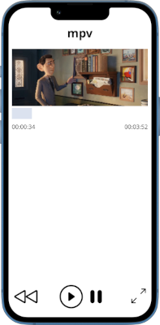
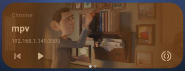

# mpv-web-remote

Simple web remote control for the [mpv media player](https://mpv.io/), using the [JSON IPC interface](https://mpv.io/manual/stable/#json-ipc).



A single binary on the host machine connects to the mpv unix socket and exposes a remote control via a web server, that can be accessed from any device on the same network (e.g. a smartphone).

The web app announces itself via the [media session API](https://developer.mozilla.org/en-US/docs/Web/API/Media_Session_API), allowing control even when the app is in the background, or from connected devices (e.g. a smartwatch).



The client code can also be used separately to interface with mpv from Rust in other use cases.

See https://c.pgdm.ch/eps-projects/mpv-web-remote

## Installation

First, edit your `~/.config/mpv/mpv.conf` to add

```
input-ipc-server=~/mpv
```

The `.deb` and Arch Linux/Manjaro packages in the [releases page](https://github.com/cpg314/mpv-web-remote/releases) will install `mpv-web-remote` as well as a `systemd` service.

It should suffice to enable it with

```console
$ systemctl --user enable --now mpv-web-remote
$ systemctl --user status mpv-web-remote
INFO [mpv_rs::mpv] Connected to socket
INFO [mpv_rs] Starting web server on http://0.0.0.0:3000
```

The web server will then be enabled shortly after a new instance of mpv is started and binds to the socket.

With the default parameters, the control interface will be accessible on <http://[ip]:3000>.

Warning: there is currently no authentication.

### Alternative: Manual installation

```console
$ cp mpv-web-remote /usr/local/bin/
$ cp mpv-web-remote.service ~/.config/systemd/user/
$ systemctl --user daemon-reload && systemctl --user enable --now mpv-web-remote
```

### Alternative: Without systemd

The server can also be started manually:

```console
$ mpv-web-remote --help
Usage: mpv-web-remote [OPTIONS] <SOCKET>

Arguments:
  <SOCKET>

Options:
      --addr <ADDR>                        [default: 0.0.0.0:3000]
  -d, --debug
      --rewind-offset-s <REWIND_OFFSET_S>  Interval for backward seek [s] [default: 10]
      --template <TEMPLATE>                Path to HTML template
  -h, --help                               Print help
```

## Other projects

- Android apps:
  - <https://github.com/husudosu/mpv-remote-app> with a Node.JS server.
  - <https://github.com/mcastorina/mpv-remote-app> with a Python server.
- https://crates.io/crates/mpvipc: fairly complete Rust interface for the mpv control interface.
